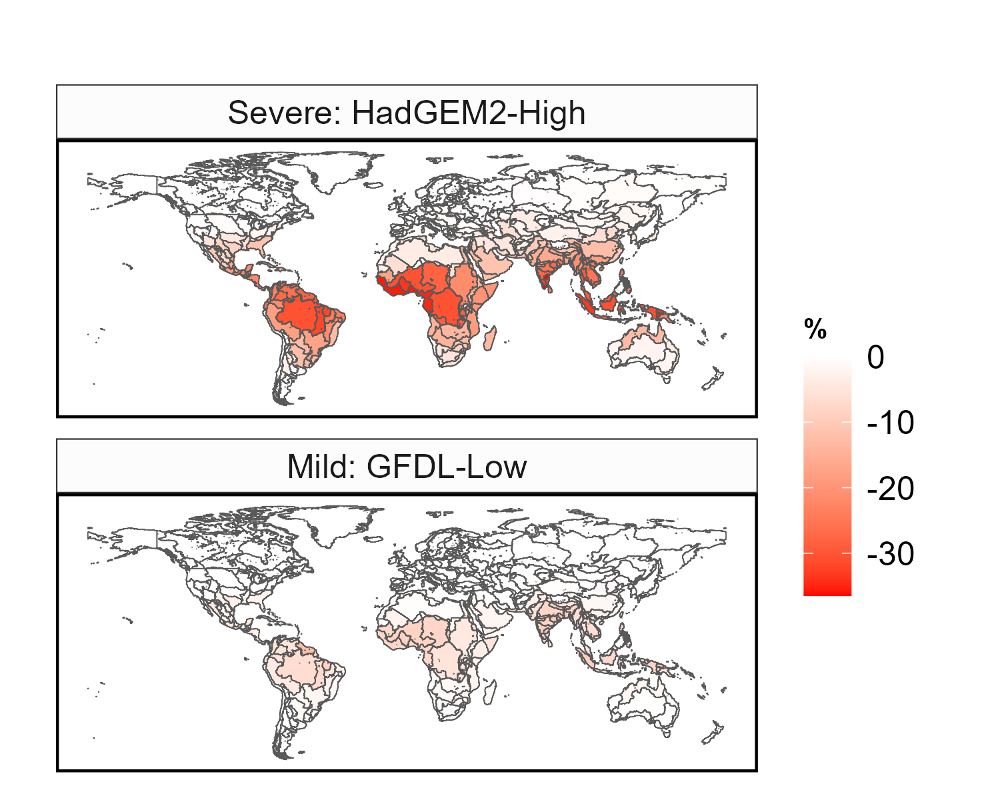
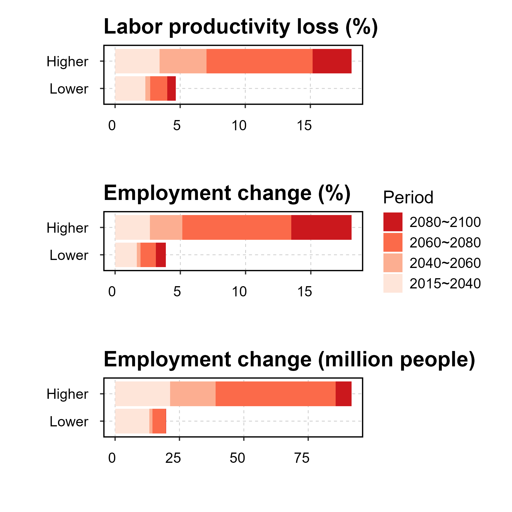
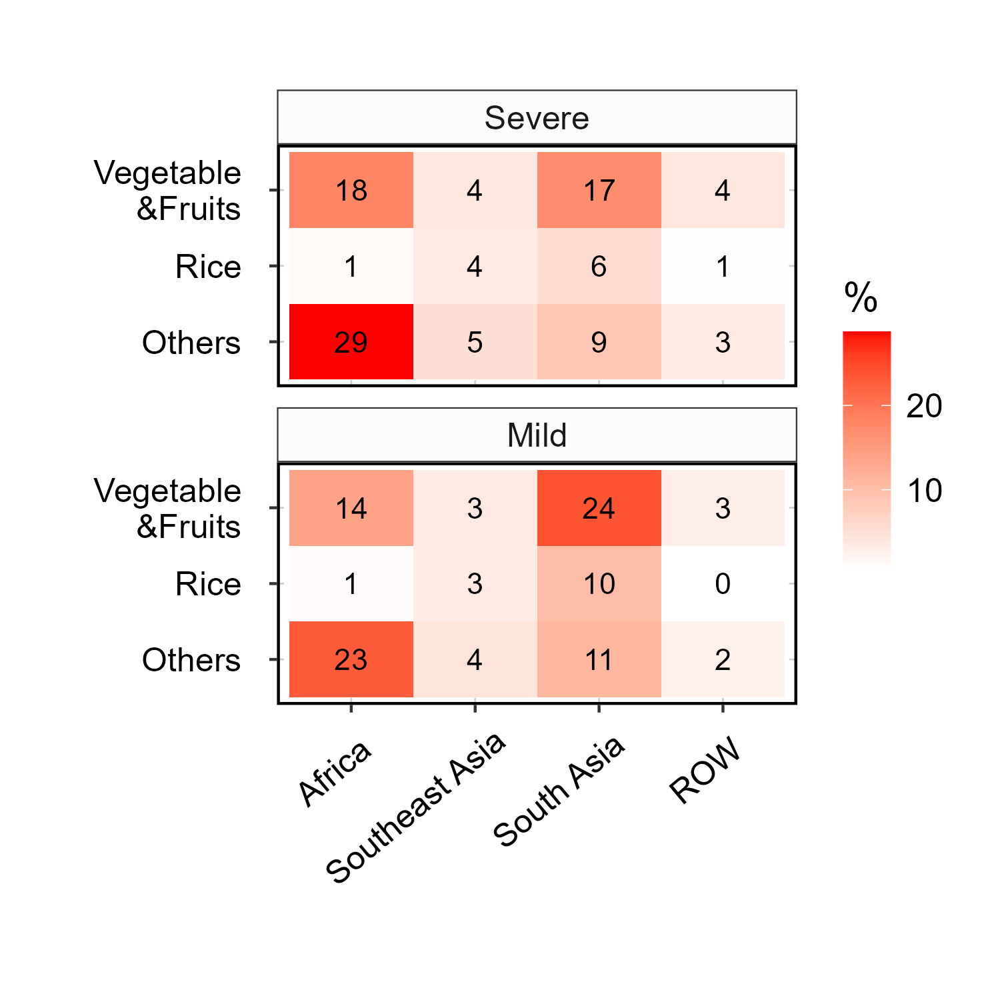
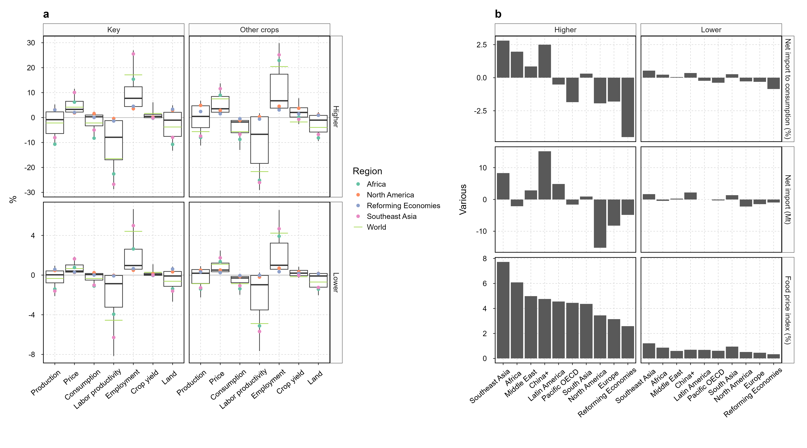
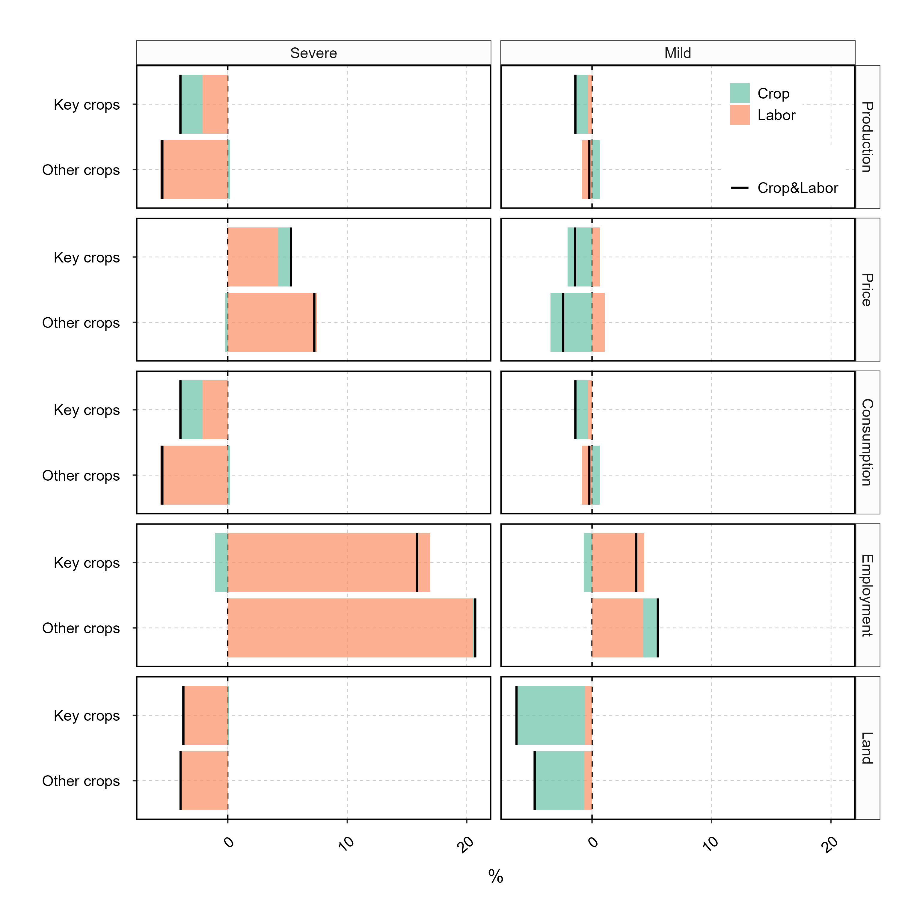
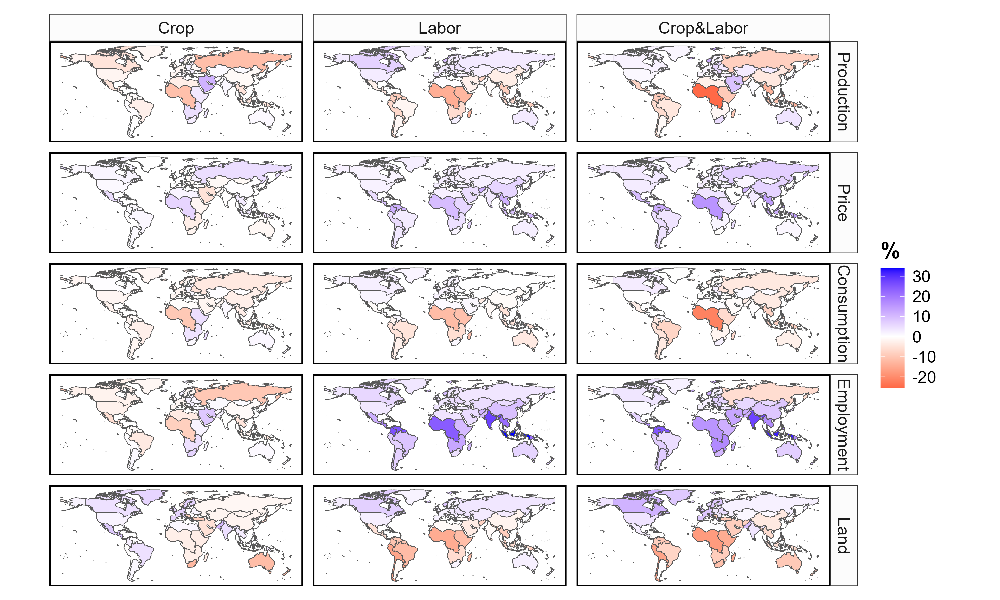

# Overview

This repository includes an R project (R codes, functions, and data) for generating key figures in the paper:

**Omitting labor responses to heat stress underestimates future climate impact on agriculture**

Di Sheng*, Xin Zhao*, James A. Edmonds, Pralit Patel, Stephanie T. Morris, Brian C. O’Neill, Claudia Tebaldi, Marshall A. Wise

Joint Global Change Research Institute, Pacific Northwest National Laboratory

*Corresponding Authors. Email:  di.sheng@pnnl.gov & xin.zhao@pnnl.gov


# Instruction
## Access to the data needed

The GCAM model and files needed for replicating the runs are archived at [realxinzhao/paper-nfood2024-AgLaborEvolution-GCAM](https://github.com/realxinzhao/paper-nfood2024-AgLaborEvolution-GCAM). The database could be a few Gigabytes so they are not included here. The queried from GCAM output database and the processed RDS data (for ths repo) are included in the **data/HeatStress/V2024** folder:


## Running the R project
Download the entire R project and run `R/main.R`. The script load data and source different R scripts to generate figures or datasets related to historical data and GCAM results. These scripts may further  source and run functions to generate figures and datasets, which will be saved in  `output/HeatStress/HeatStress`.


## Package output and size
The package output includes figures and datasets (`output/*` included in this repo). 
The size of the output figure folder is about 9MB. 
The ProjectRDS data folder is about 251MB. 
The data folder is about 666 MB.

## R Session Information

```
R version 4.4.0 (2024-04-24 ucrt)
Platform: x86_64-w64-mingw32/x64
Running under: Windows 10 x64 (build 19045)

Matrix products: default


locale:
[1] LC_COLLATE=English_United States.utf8  LC_CTYPE=English_United States.utf8   
[3] LC_MONETARY=English_United States.utf8 LC_NUMERIC=C                          
[5] LC_TIME=English_United States.utf8    

time zone: America/New_York
tzcode source: internal

attached base packages:
[1] stats     graphics  grDevices utils     datasets  methods   base     

other attached packages:
 [1] RColorBrewer_1.1-3 sf_1.0-18          patchwork_1.2.0    purrr_1.0.2       
 [5] gcamdata_5.1       dplyr_1.1.4        scales_1.3.0       ggsci_3.2.0       
 [9] ggplot2_3.5.1      stringr_1.5.1      tidyr_1.3.1       

loaded via a namespace (and not attached):
 [1] utf8_1.2.4         generics_0.1.3     class_7.3-22       KernSmooth_2.23-22
 [5] lattice_0.22-6     stringi_1.8.4      hms_1.1.3          magrittr_2.0.3    
 [9] grid_4.4.0         Matrix_1.7-0       e1071_1.7-14       DBI_1.2.3         
[13] mgcv_1.9-1         fansi_1.0.6        textshaping_0.4.0  cli_3.6.3         
[17] rlang_1.1.4        crayon_1.5.3       units_0.8-5        splines_4.4.0     
[21] bit64_4.0.5        munsell_0.5.1      withr_3.0.0        tools_4.4.0       
[25] parallel_4.4.0     tzdb_0.4.0         colorspace_2.1-0   assertthat_0.2.1  
[29] vctrs_0.6.5        R6_2.5.1           proxy_0.4-27       lifecycle_1.0.4   
[33] classInt_0.4-10    bit_4.0.5          vroom_1.6.5        ragg_1.3.2        
[37] pkgconfig_2.0.3    pillar_1.9.0       gtable_0.3.5       data.table_1.15.4 
[41] glue_1.7.0         Rcpp_1.0.13        systemfonts_1.1.0  tibble_3.2.1      
[45] tidyselect_1.2.1   rstudioapi_0.16.0  farver_2.1.2       nlme_3.1-164      
[49] labeling_0.4.3     readr_2.1.5        compiler_4.4.0    
```

Key Figures

Fig. 2A.


Fig. 2B.


Fig. 2C.


Fig. 3. 


Fig. 4A. 


Fig. 4B. 
